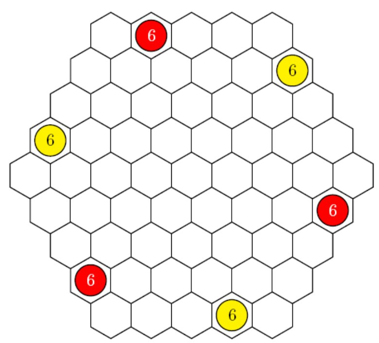
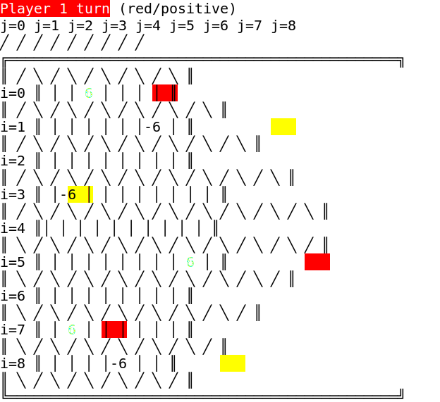
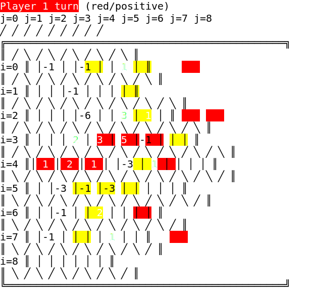
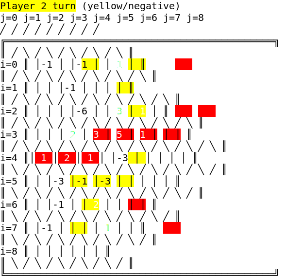

# Glaisher <!-- omit in toc -->

[](https://www.gnu.org/licenses/gpl-3.0)


- **Project name:** Glaisher
- **Short description:** Board game implemented in PROLOG
- **Environment:** SICStus PROLOG
- **Tools:** PROLOG
- **Institution:** [FEUP](https://sigarra.up.pt/feup/en/web_page.Inicial)
- **Course:** [PLOG](https://sigarra.up.pt/feup/en/UCURR_GERAL.FICHA_UC_VIEW?pv_ocorrencia_id=459482) (Logic Programming) <!-- - **Project grade:** ??.?/20.0 -->
- **TP class:** 3MIEIC02
- **Group:** Glaisher_4
- **Group members:** 
    - [Breno Accioly de Barros Pimentel](https://github.com/BrenoAccioly) (<up201800170@fe.up.pt>)
    - [Diogo Miguel Ferreira Rodrigues](https://github.com/dmfrodrigues) (<up201806429@fe.up.pt>)

## Index <!-- omit in toc -->

- [Installing and executing](#installing-and-executing)
  - [Installing](#installing)
  - [Executing](#executing)
- [The game](#the-game)
  - [Preparation](#preparation)
  - [Game play](#game-play)
- [Game logic](#game-logic)
  - [Game state representation](#game-state-representation)
  - [Game state visualization](#game-state-visualization)
  - [Executing a moves](#executing-a-moves)
  - [List of valid moves](#list-of-valid-moves)
  - [End game](#end-game)
  - [Board evaluation](#board-evaluation)
  - [Computer move](#computer-move)
    - [Classical approach](#classical-approach)
    - [Practical approach](#practical-approach)
- [Conclusions](#conclusions)
  - [Parallel programming](#parallel-programming)
  - [Known issues](#known-issues)
- [Bibliography](#bibliography)


## Installing and executing

### Installing

To run this game you need a running Prolog environment, preferably one of the tested environments:
- [SICStus Prolog](https://sicstus.sics.se/)
- [SWI-Prolog](https://www.swi-prolog.org/)

If you cloned this repository from GitHub, you should additionally run `git submodule update --init --recursive` to clone all submodules as well.

After obtaining this project (or cloning it), you're set!

### Executing

This program can be executed as per the project guidelines.

To run the program using colored text, run `sicstus`/`swipl` with argument `color`:

```sh
sicstus -l game.pl            # Run with sicstus, without color
sicstus -l game.pl -- color   # Run with sicstus, with color
swipl   -l game.pl            # Run with swipl, without color
swipl   -l game.pl -- color   # Run with swipl, with color
```

Under **Linux**, `sh` and `bash` should correctly present special characters; if the terminals are coloured, they should also correctly present colors.

Under **Windows**, when using any console you are advised to use one of the following fonts, which have been confirmed to correctly render all characters:
- Consolas
- DejaVu Sans Mono (preferred)
- Source Code Pro

Under **Windows**, colors are correctly displayed in all situations, except at least on the SICStus console (where colors do not render but the rest is fine), and `sicstus` running on cmd/PowerShell (colors are rendered as unknown characters).

## The game

```txt
 ▟▀▀▀▙ █ ▗▄▄▖▄ ▀ ▗▄▄▄ █    ▗▄▄▖ ▄▗▄ 
 █ ▄▄▄ █ █  ▜█ █ ▜▄▄▖ █▀▀▙ █▄▄█ █▀  
 ▜▄▄▄▛ █ ▜▄▄▛█ █ ▄▄▄▛ █  █ ▜▄▄▖ █   

 A game for two players by Ken Shoda
 Developed by Breno Pimentel & Diogo Rodrigues, in SICStus/SWI Prolog
```

The game we implemented is called [Glaisher](https://nestorgames.com/#glaisher_detail) (the rules are available [here](https://nestorgames.com/rulebooks/GLAISHER_EN.pdf)), named after [Glaisher's theorem](https://en.wikipedia.org/wiki/Glaisher%27s_theorem).
It is played on a hexagonal board ([hex map](https://en.wikipedia.org/wiki/Hex_map)) with a side of 5 hexagonal cells (hexes). Each player has a color, usually red for Player 1 and yellow for Player 2.
There are 75 double-sided pieces painted red on one side and yellow on the other.

### Preparation

Each player places three 6-stacks (stacks of 6 pieces) of his/her color (all pieces with his/her color facing up) on the board as per the following image.
The rest of the pieces are kept in a shared reserve.



### Game play

Players take turns in doing two consecutive, mandatory actions:
1. **Separate and move a stack:** a stack can be separated into many substacks (it can also be "separated" into a single substack), under the condition that all substacks must have different heights. After separating the stack, all substacks must move in the same direction, and each stack travels as many hexes as it is tall (e.g., a 2-substack must travel 2 hexes), including over adversary stacks.
    - If a substack moves to a hex with a taller opponent stack, the move is illegal.
    - If a substack moves to a hex with a shorter or equal opponent stack, your stack captures the opponent stack.
2. **Place a new piece:** grab a new piece from the reserve, and place it in any empty hex with your color facing up (thus creating a 1-stack).

The objective is to connect any pair of opposite sides of the board with a contiguous chain of stacks with your color. A player can also lose when he has no legal moves in item 1.

## Game logic

Firstly, some brief notes on how to work with this game.
- Every option/command must be ended with a period `.` (e.g., `[4, 2].`).

### Game state representation

The board is internally represented as a list of lists that can be queried using predicate `board(Board, I-J, N)`, meaning in position `(I, J)` there is a stack of `N` pieces, with `N` positive if the stack is made of red pieces, and negative if it is made of yellow pieces.

```txt
                    j=0 j=1 j=2 j=3 j=4 j=5 j=6 j=7 j=8
                     /   /   /   /   /   /   /   /   /
                                        /   /   /   /
                 / \ / \ / \ / \ / \   /   /   /   /
i=0 ----------> |   | 6 |   |   |   |     /   /   /
               / \ / \ / \ / \ / \ / \   /   /   /
i=1 --------> |   |   |   |   |   |-6 |     /   /
             / \ / \ / \ / \ / \ / \ / \   /   /
i=2 ------> |   |   |   |   |   |   |   |     /
           / \ / \ / \ / \ / \ / \ / \ / \   /
i=3 ----> |-6 |   |   |   |   |   |   |   |  
         / \ / \ / \ / \ / \ / \ / \ / \ / \ 
i=4 --> |   |   |   |   |   |   |   |   |   |
         \ / \ / \ / \ / \ / \ / \ / \ / \ / 
i=5 ----> |   |   |   |   |   |   |   | 6 |
           \ / \ / \ / \ / \ / \ / \ / \ /
i=6 ------> |   |   |   |   |   |   |   |
             \ / \ / \ / \ / \ / \ / \ /
i=7 --------> | 6 |   |   |   |   |   |
               \ / \ / \ / \ / \ / \ /
i=8 ----------> |   |   |   |-6 |   |
                 \ / \ / \ / \ / \ /
```

The cells adjacent to `(I, J)` are:
- `(I-1, J)` (below left)
- `(I+1, J)` (above right)
- `(I, J-1)` (left)
- `(I, J+1)` (right)
- `(I-1, J-1)` (above left)
- `(I+1, J+1)` (below right)

Some positions are not valid (e.g. `(1, 6)`), which can be checked by calling `board_is_valid_position(I-J)`.

The game state is internally represented by pseudo-structure `gamestate(Board, Turn)`, where `Board` is the game board and `Turn` is the turn of the current player. `Turn` is 1 for player 1, and 2 for player 2.

Although the physical board game comes with 75 pieces, the game play is not limited in any way by the lack of pieces since it is assumed there is always the required number of pieces.
Thus, we will not keep the number of pieces in reserve.

#### Initial state <!-- omit in toc -->
The initial state is represented with each player with three 6-stacks.

Initial state in Prolog:
```prolog
gamestate(
    [ % Board
        [  0,  6,  0,  0,  0,nan,nan,nan,nan],
        [  0,  0,  0,  0,  0, -6,nan,nan,nan],
        [  0,  0,  0,  0,  0,  0,  0,nan,nan],
        [ -6,  0,  0,  0,  0,  0,  0,  0,nan],
        [  0,  0,  0,  0,  0,  0,  0,  0,  0],
        [nan,  0,  0,  0,  0,  0,  0,  0,  6],
        [nan,nan,  0,  0,  0,  0,  0,  0,  0],
        [nan,nan,nan,  6,  0,  0,  0,  0,  0],
        [nan,nan,nan,nan,  0,  0,  0, -6,  0]
    ],
    1 % Player turn
)
```

This state can be obtained by consulting `sample-states/initial_state.pl` (from the root of the project), and calling `initial_state(GameState).`.

#### Intermediate state <!-- omit in toc -->
When both players still have valid moves.

Example of an intermediate state in Prolog:
```prolog
gamestate(
    [ % Board
        [ -1,  0, -1,  0,  1,nan,nan,nan,nan],
        [  0,  0, -1,  0,  0,  0,nan,nan,nan],
        [  0,  0,  0, -6,  0,  3,  1,nan,nan],
        [  0,  0,  2,  3,  5, -1,  0,  0,nan],
        [  1,  2,  1,  0, -3,  1,  0,  0,  0],
        [nan,  0, -3, -1, -3,  0,  0,  0,  0],
        [nan,nan,  0, -1,  0,  2,  0,  0,  0],
        [nan,nan,nan, -1,  0,  0,  0,  1,  0],
        [nan,nan,nan,nan,  0,  0,  0,  0,  0]
    ],
    1 % Player turn
)
```

This state can be obtained by consulting `sample-states/intermediate_state.pl` (from the root of the project), and calling `intermediate_state(GameState).`.

#### Final state <!-- omit in toc -->
As stated in the Game play section, when a player connects any two opposite sides of the game board or if a player cannot separate and move any stacks, it is a final state.

Example of a final state in Prolog:
```prolog
gamestate(
    [ % Board
        [ -1,  0, -1,  0,  1,nan,nan,nan,nan],
        [  0,  0, -1,  0,  0,  0,nan,nan,nan],
        [  0,  0,  0, -6,  0,  3,  1,nan,nan],
        [  0,  0,  2,  3,  5,  1,  0,  0,nan],
        [  1,  2,  1,  0, -3,  0,  0,  0,  0],
        [nan,  0, -3, -1, -3,  0,  0,  0,  0],
        [nan,nan,  0, -1,  0,  2,  0,  0,  0],
        [nan,nan,nan, -1,  0,  0,  0,  1,  0],
        [nan,nan,nan,nan,  0,  0,  0,  0,  0]
    ],
    2 % Player turn
)
```

This state can be obtained by consulting `sample-states/final_state.pl` (from the root of the project), and calling `final_state(GameState).`.

### Game state visualization

On entering the game, you can choose to play the game (`1.`), see the instructions (`2.`) or quit (`0.`). We highly recommend reading the instructions, as they specify the correct input formats. If you choose to play the game, you are prompted to choose one of three game modes, or quit (`0.`):
- Human vs Human (`1.`)
- Human vs Computer (`2.`)
- Computer vs Computer (`3.`)

If you select `2.` or `3.` you are prompted about the difficulty level of the autonomous player (from 1 to 3). Then the game starts; the game state is shown at the beginning of each turn, and human players are prompted to introduce the information necessary to make up a complete move. If the move is invalid the player is reprompted. A player can press `q.` to quit a game.

The following states were obtained by running `make svg`, which runs the PROLOG programs to print each state in a computer-friendly way, parses it using a python script and renders as an SVG image.

#### Initial state <!-- omit in toc -->



Obtained by running `make img/initial_print_simple.svg`; can alternatively be displayed in a console by consulting `sample-states/display_initial_state.pl`.

#### Intermediate state <!-- omit in toc -->



Obtained by running `make img/intermediate_print_simple.svg`; can alternatively be displayed in a console by consulting `sample-states/display_intermediate_state.pl`.

#### Final state <!-- omit in toc -->



Obtained by running `make img/final_print_simple.svg`; can alternatively be displayed in a console by consulting `sample-states/display_final_state.pl`.

### Executing a moves

A move `playermove(Player, Pos, Substacks, Direction, NewPos)` is valid iff:
1. `Pos` is the position of a stack controlled by `Player`
2. `Substacks` is a list of distinct numbers, all with same sign (non-zero) and adding up to the height of the stack at `Pos`
3. `Direction` describes a valid direction (below)
4. By moving the substacks according to the rules (one cell for each piece in the substack in the mentioned `Direction`), no piece falls outside the board nor does it land on top of an adversary stack taller than the moving substack
5. `NewPos` is the position to place the new 1-stack, which is empty as of the time all the previous actions were executed

Directions:

```
      3     2      
       ╲   ╱       
        ╱ ╲        
 4 <── │ # │ ──> 1 
        ╲ ╱        
       ╱   ╲       
      5     6
```

A player can perform a move by calling `move(+GameState, ?Playermove, -NewGameState)`, which returns the new game state if the move is valid, or fails if the move is not valid.

### List of valid moves

`move` can also sequentially return all valid moves, as all required predicates were implemented to expect grounded values, or otherwise generate all valid values for those parameters (for instance, `between(+L,+R,?X)` evaluates if `X` is between `L` and `R` if `X` is grounded, or otherwise returns all possible values for `X`).

A player can get his list of valid moves by evaluating predicate `valid_moves(+GameState, +Player, -ListOfMoves)`, which uses `findall` over predicate `move(+GameState, ?Playermove, -NewGameState)`. Since `move` does not return repeated moves we don't have to worry about using `setof` for instance.

### End game

`game_over(+GameState, -Winner)` analyses the provided game state, and returns the winner if there is one, or fails if the game is not yet over. It calls the helper predicate `game_over_(+GameState, +Winner)` to ground Winner to each of the two possible values.

It firstly evaluates if the player has any valid moves left, by using predicate `has_valid_moves(+Board, +Player)` (finds the first valid move).

It then goes on to check if the player successfully connected opposite sides of the board with a bridge of his/her color, by using a Depth-First Search algorithm `dfs(+Board, +Player, +Stack, +Visited, -Ret)` which takes as arguments the Board, the Player presumed to have won, the DFS stack so far (is initialized with all cells of a board side), the Visited nodes (starts empty) and stops when one of the nodes in Ret is visited (initialized with the cells of the opposite side).

### Board evaluation

<!-- TODO -->

### Computer move

Say that an autonomous player with level 0 evaluates the best move he can take, level 1 evaluates the best move he can take taking into consideration the best move his adversary can make, level 2 evaluates the best move he can take taking into consideration the best move his adversary can make and his own best move in the next round, and so on.

All programs that use `choose_move` must have defined dynamic predicate `base_directory`, since `choose_move` launches multiple processes and as such it must know the repository's base directory so it can import files correctly. `base_directory` is most usually initialized with

```prolog
:-
    current_working_directory(CWD),
    BASE = CWD,
    assert(base_directory(BASE)).
```

#### Classical approach

In most games, a move is simply just that: moving one piece according to the game's rules. This usually implies the number of possible moves is approximately equal to the number of player pieces in the board (estimated from the board size) times the number of possible moves for a piece (usually restricted by game rules).

In this game, however, a move consists of two actions: splitting a stack and moving the substacks, and placing a new piece. Each of these actions are similar to the *single move* in most games, meaning that, given a fixed game board, the number of moves in Glaisher is approximately the square of the number of moves in other games.

This obviously implies Glaisher allows many more moves than other games, thus leading to additional complications in terms of autonomous player runtime, given the following reference values:
- Evaluating the initial board takes 1.5ms
- Player 1 has 1290 possible moves in the initial board
- Thus a level 1 autonomous player would take at least 1.9s to choose a move

That is for level 0, because for level 2, even if we were to use a greedy strategy, for each possible move let B1 be the board it generates, we would have to:
- Evaluate all possible adversary moves in B1, and choose the best move, originating board B2
- Evaluate all possible player moves in B2, and choose the best move

This amounts to evaluating approximately 1290*(1290+1290) = 3.3e6 boards, which would take approx. 1h23min to compute.

We are thus required to reduce the complexity of the level 2 autonomous player computations, because from this point on time complexity is linear; as a matter of fact, a level L autonomous player would require approximately 1290*(L\*1290) computations.

#### Practical approach

We have decided to discard some states to speed up `choose_move` using a greedy strategy, which to the best of our knowledge discards a significant portion of states while having little impact on the quality of the final result (i.e., chooses the states that we consider can originate the best outcomes in the future).

We have thus use the following strategy to discard some states:
1. Get all moves that differ in the first action, and choose as second action the first valid move
2. Evaluate those moves
3. Choose the N best moves
4. Expand those N moves into all possible moves by varying the second action
5. Choose the best move

The number of evaluations is very roughly the number of possibilities for the first action (A1), plus N times the number of possibilities for the second action (A2). Assume a third of the board cells (20) have stacks, and the others (41) are empty. A2 can be estimated to be on the same order of magnitude of the number of empty board cells: A2=41. As for A1, assume the average stack height is 6, and that a 6-stack can move in 6 directions and be partitioned in 4 ways (ignoring the fact some of those moves fall out of the board and are thus invalid), we have that A1=20\*6\*4=480. Thus the upper bound of the number of evaluations is estimated to be A1+N\*A2=480+41\*N for level 0. In practice A1 will be quite smaller. Now we can tune N to find a decent value that does not cause much computation delay but gives the best possible answer. The general complexity formula for level L is approximately A1+N\*A2\*L\*(A1+A2).

Using these ideas, we implemented `choose_move_1(+GameState, +Turn, +Level, +N, -Move, -Value)`.

Because we believe we could miss out on some cases where it would be more reasonable to consider action 2 first, we implemented a similar predicate `choose_move_2(+GameState, +Turn, +Level, +N, -Move, -Value)`, which is in all similar to `choose_move_1` but it starts by getting all moves that differ in action 2, and at step 4 expand into all possible moves by varying the first action. We expect it to have a complexity similar to `choose_move_1`.

These two predicates are used to implement `choose_move(+GameState, +Turn, +Level, +N, -Move)`.

## Conclusions

This was a challenging project, due not only to the fact it uses Prolog which greatly differs from imperative programming, but also because the [nature of this game](#computer-move) made it very distinct from other board games since in this game a turn has two actions and not one as usual.

### Parallel programming

Prolog programs can very much benefit from parallel programming; however, SICStus Prolog does not support parallel programming out-of-the-box. Nevertheless, one can possibly implement some predicates to perform parallel programming by using the `process` library to create and manage processes.

### Known issues

Autonomous players are a bit slow. In particular, autonomous players become increasingly slow as the game progresses although they tend to stabilize at around the tens of seconds per turn. However, they become extremely slow on the last 1-2 rounds before end game, or when stacks become particularly tall (generally above or around 20 pieces).

On Computer vs Computer mode, only level 2 autonomous players are known to end the game (in about 50min); it is unknown if level 1 and level 3 autonomous players can end the game (as the game has not ended after at least 1h in both cases).

## Bibliography

- RISE (2020, Apr). [SICStus Prolog 4.6.0](https://sicstus.sics.se/sicstus/docs/latest4/html/sicstus.html/) \[Documentation\]. Gothenburg, Sweden: RISE Research Institutes of Sweden AB.
- Shoda, K. (2015). [Glaisher](https://nestorgames.com/rulebooks/GLAISHER_EN.pdf) \[Game rules\]. Spain: nestorgames.
- Wielemaker, J. et al. (2020). [SWI Prolog 8.3.13](https://www.swi-prolog.org/pldoc/doc_for?object=root) \[Documentation\]. Amsterdam, Netherlands: Sociaal-Wetenschappelijke Informatica, University of Amsterdam.
