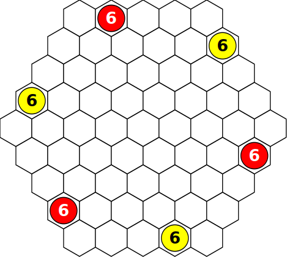
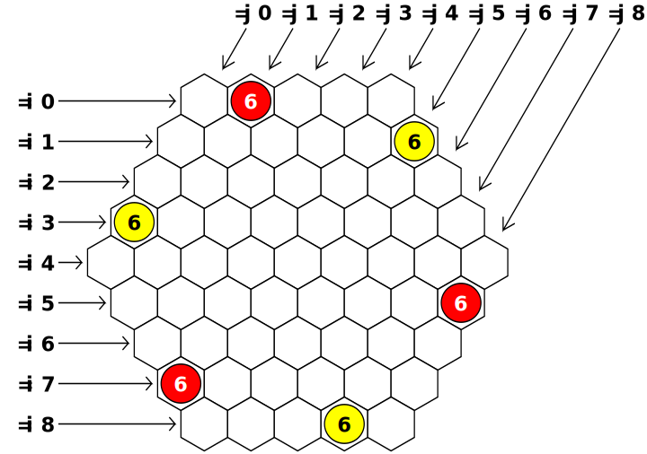

<!--
(C) 2020 Diogo Rodrigues, Breno Pimentel
Distributed under the terms of the GNU General Public License, version 3
-->

# Glaisher <!-- omit in toc -->

[](https://www.gnu.org/licenses/gpl-3.0)


- **Project name:** Glaisher
- **Short description:** Board game implemented in Prolog
- **Environment:** SICStus Prolog
- **Tools:** Prolog
- **Institution:** [FEUP](https://sigarra.up.pt/feup/en/web_page.Inicial)
- **Course:** [PLOG](https://sigarra.up.pt/feup/en/UCURR_GERAL.FICHA_UC_VIEW?pv_ocorrencia_id=459482) (Logic Programming) <!-- - **Project grade:** ??.?/20.0 -->
- **TP class:** 3MIEIC02
- **Group:** Glaisher_4
- **Group members:** 
    - [Breno Accioly de Barros Pimentel](https://github.com/BrenoAccioly) (<up201800170@fe.up.pt>)
    - [Diogo Miguel Ferreira Rodrigues](https://github.com/dmfrodrigues) (<up201806429@fe.up.pt>)

## License <!-- omit in toc -->

© 2020 Diogo Rodrigues, Breno Pimentel

All files are licensed under GNU General Public License v3, to the exception of:
- submodules, which are subject to specific licenses

Based the homonymous game by Nestor Romeral Andres and Ken Shoda, publicly available through nestorgames.  
We lay claim only over the software; this software cannot be used for commercial purposes.  
Made available under [GNU General Public License v3](LICENSE), copyrighted material used under *fair use for education*.

## Index <!-- omit in toc -->

- [Installing and executing](#installing-and-executing)
  - [Installing](#installing)
  - [Executing](#executing)
- [The game](#the-game)
  - [Preparation](#preparation)
  - [Game play](#game-play)
- [Game logic](#game-logic)
  - [Game state representation](#game-state-representation)
  - [Game state visualization](#game-state-visualization)
  - [Executing a moves](#executing-a-moves)
  - [List of valid moves](#list-of-valid-moves)
  - [End game](#end-game)
  - [Board evaluation](#board-evaluation)
  - [Computer move](#computer-move)
    - [Classical approach](#classical-approach)
    - [Practical approach](#practical-approach)
- [Conclusions](#conclusions)
  - [Challenges](#challenges)
  - [Features](#features)
- [Bibliography](#bibliography)


## Installing and executing

### Installing

#### Requisites <!-- omit in toc -->

To run this game you need a running Prolog environment, preferably one of the tested environments:
- [SICStus Prolog](https://sicstus.sics.se/)
- [SWI-Prolog](https://www.swi-prolog.org/)

#### Cloning <!-- omit in toc -->

If you cloned this repository from GitHub, you should additionally run
```sh
git submodule update --init --recursive
```
to clone all submodules as well.

#### Compiling <!-- omit in toc -->

After obtaining this project, if you are using SICStus Prolog you need to compile some files to use multiprocessing. To do that, run
```sh
make PROLOG=sicstus                     # If you're using a Linux distro
make -f makefile-win.mk PROLOG=sicstus  # If you're using Windows
```

### Executing

This program can be executed as per the project guidelines.

To run the program using colored text, run `sicstus`/`swipl` with argument `color`:

```sh
sicstus -l src/game.pl            # Run with sicstus, without color
sicstus -l src/game.pl -- color   # Run with sicstus, with color
swipl   -l src/game.pl            # Run with swipl, without color
swipl   -l src/game.pl -- color   # Run with swipl, with color
```

Under **Windows**, when using any console you are advised to use one of the following fonts, which have been confirmed to correctly render all characters:
- Consolas
- DejaVu Sans Mono (preferred)
- Source Code Pro

Under **Windows**, the SICStus console does not render color.

These are the situations where colors should be correctly rendered (the Windows alternatives are under Microsoft Windows 10, the Linux alternatives are under Ubuntu 20.04.1 LTS):

| Environment             | cmd                | Powershell         | VSCode cmd         | VSCode Powershell  | GNOME terminal     | Terminator         | XTerm              |
|-------------------------|--------------------|--------------------|--------------------|--------------------|--------------------|--------------------|--------------------|
| SICStus                 | :x:                | :x:                | :heavy_check_mark: | :heavy_check_mark: | :heavy_check_mark: | :heavy_check_mark: | :heavy_check_mark: |
| SWI                     | :heavy_check_mark: | :heavy_check_mark: | :heavy_check_mark: | :heavy_check_mark: | :heavy_check_mark: | :heavy_check_mark: | :heavy_check_mark: |

The game can additionally be run using multiprocessing (check section on [computer move](#computer-move)):

```sh
sicstus -l src/game.pl -- parallel          # Run with sicstus, without color and using multiprocessing
sicstus -l src/game.pl -- color parallel    # Run with sicstus, with color and using multiprocessing
swipl   -l src/game.pl -- parallel          # Run with swipl, without color and using multiprocessing
swipl   -l src/game.pl -- color parallel    # Run with swipl, with color and using multiprocessing
```

## The game

```txt
 ▟▀▀▀▙ █ ▗▄▄▖▄ ▀ ▗▄▄▄ █    ▗▄▄▖ ▄▗▄ 
 █ ▄▄▄ █ █  ▜█ █ ▜▄▄▖ █▀▀▙ █▄▄█ █▀  
 ▜▄▄▄▛ █ ▜▄▄▛█ █ ▄▄▄▛ █  █ ▜▄▄▖ █   

 A game for two players by Ken Shoda
 Developed by Breno Pimentel & Diogo Rodrigues, in SICStus/SWI Prolog
```

The game we implemented is called [Glaisher](https://nestorgames.com/#glaisher_detail), after [Glaisher's theorem](https://en.wikipedia.org/wiki/Glaisher%27s_theorem) (the rules are available [here](https://nestorgames.com/rulebooks/GLAISHER_EN.pdf)).
It is played on a hexagonal board made of hexagonal cells (hexes), with a side of 5 hexes.
It is player by two players, Player 1 (red) and Player 2 (yellow).
There are 75 double-sided pieces painted red on one side and yellow on the other.

### Preparation

Each player places three 6-stacks (stacks of 6 pieces) of his/her color (all pieces with his/her color facing up) on the board as per the following image.
The rest of the pieces are kept in a shared reserve.



### Game play

Players take turns in doing two consecutive, mandatory actions:
1. **Separate and move a stack:** a stack can be separated into many substacks (it can also be "separated" into a single substack), under the condition that all substacks must have different heights. After separating the stack, all substacks must move in the same direction, and each stack travels as many hexes as it is tall (e.g., a 2-substack must travel 2 hexes), including over adversary stacks.
    - If a substack moves to a hex with a taller opponent stack, the move is illegal.
    - If a substack moves to a hex with a shorter or equal opponent stack, you capture the adversary stack (turn the whole opponent stack upside down to have your color facing up, and put your moving substack on top of the captured stack).
2. **Place a new piece:** grab a new piece from the reserve, and place it with your color facing up in any empty hex (thus creating a 1-stack).

The objective is to connect any pair of opposite sides of the board with a contiguous chain of stacks with your color. A player also loses when he has no legal moves in item 1, making his/her opponent the winner.

## Game logic

### Game state representation

The board is internally represented as a list of lists that can be queried using predicate `board(Board, I-J, N)`, meaning in position `(I, J)` there is a stack of `N` pieces, with `N` positive if the stack is made of red pieces, and negative if it is made of yellow pieces.



Cell `(I, J)` is adjacent to cells:
- `(I-1, J)` (below left)
- `(I+1, J)` (above right)
- `(I, J-1)` (left)
- `(I, J+1)` (right)
- `(I-1, J-1)` (above left)
- `(I+1, J+1)` (below right)

Some positions are not valid (e.g. `(1, 6)`), which can be checked by calling `board_is_valid_position(I-J)`.

The game state is internally represented by pseudo-structure `gamestate(Board, Turn)`, where `Board` is the game board and `Turn` is the turn of the current player. `Turn` is 1 for player 1, and 2 for player 2.

Although the physical board game comes with 75 pieces, the game play is not limited in any way by the number of pieces.
Thus, we will not track the number of pieces in reserve.

#### Initial state <!-- omit in toc -->

```prolog
gamestate(
    [ % Board
        [  0,  6,  0,  0,  0,nan,nan,nan,nan],
        [  0,  0,  0,  0,  0, -6,nan,nan,nan],
        [  0,  0,  0,  0,  0,  0,  0,nan,nan],
        [ -6,  0,  0,  0,  0,  0,  0,  0,nan],
        [  0,  0,  0,  0,  0,  0,  0,  0,  0],
        [nan,  0,  0,  0,  0,  0,  0,  0,  6],
        [nan,nan,  0,  0,  0,  0,  0,  0,  0],
        [nan,nan,nan,  6,  0,  0,  0,  0,  0],
        [nan,nan,nan,nan,  0,  0,  0, -6,  0]
    ],
    1 % Player turn
)
```

This state can be obtained by consulting `sample-states/initial_state.pl` (from the root of the project), and calling `initial_state(GameState).`.

#### Intermediate state <!-- omit in toc -->

When both players still have valid moves.

```prolog
gamestate(
    [ % Board
        [ -1,  0, -1,  0,  1,nan,nan,nan,nan],
        [  0,  0, -1,  0,  0,  0,nan,nan,nan],
        [  0,  0,  0, -6,  0,  3,  1,nan,nan],
        [  0,  0,  2,  3,  5, -1,  0,  0,nan],
        [  1,  2,  1,  0, -3,  1,  0,  0,  0],
        [nan,  0, -3, -1, -3,  0,  0,  0,  0],
        [nan,nan,  0, -1,  0,  2,  0,  0,  0],
        [nan,nan,nan, -1,  0,  0,  0,  1,  0],
        [nan,nan,nan,nan,  0,  0,  0,  0,  0]
    ],
    1 % Player turn
)
```

This state can be obtained by consulting `sample-states/intermediate_state.pl` (from the root of the project), and calling `intermediate_state(GameState).`.

#### Final state <!-- omit in toc -->

As per the [game play section](#game-play), a state is final when a player connects any two opposite sides of the board,  or if a player has no valid moves.

```prolog
gamestate(
    [ % Board
        [ -1,  0, -1,  0,  1,nan,nan,nan,nan],
        [  0,  0, -1,  0,  0,  0,nan,nan,nan],
        [  0,  0,  0, -6,  0,  3,  1,nan,nan],
        [  0,  0,  2,  3,  5,  1,  0,  0,nan],
        [  1,  2,  1,  0, -3,  0,  0,  0,  0],
        [nan,  0, -3, -1, -3,  0,  0,  0,  0],
        [nan,nan,  0, -1,  0,  2,  0,  0,  0],
        [nan,nan,nan, -1,  0,  0,  0,  1,  0],
        [nan,nan,nan,nan,  0,  0,  0,  0,  0]
    ],
    2 % Player turn
)
```

This state can be obtained by consulting `sample-states/final_state.pl` (from the root of the project), and calling `final_state(GameState).`.

### Game state visualization

On entering the game using the `play.` predicate (after consulting `game.pl`, obviously), you can choose to play the game (`1.`), see the instructions (`2.`) or quit (`0.`). We highly recommend reading the instructions, as they specify the correct input formats. If you choose to play the game, you are prompted to choose one of three game modes, or quit (`0.`):
- Human vs Human (`1.`)
- Human vs Computer (`2.`)
- Computer vs Computer (`3.`)

If you select `2.` or `3.` you are prompted about the difficulty level of the autonomous player (from 1 to 3). Then the game starts; the game state is shown at the beginning of each turn (the round number is also tracked), and human players are prompted to introduce the information necessary to make up a complete move. If the move is invalid the player is reprompted. A player can press `q.` to quit a game.

The following states were obtained by running `make svg`, which runs the Prolog programs to print each state in JSON format, parse them using a python script and save them as SVG images.

#### Initial state <!-- omit in toc -->


Obtained by running `make img/initial_print_simple.svg`; can alternatively be displayed in a console by consulting `sample-states/display_initial_state.pl`.

#### Intermediate state <!-- omit in toc -->


Obtained by running `make img/intermediate_print_simple.svg`; can alternatively be displayed in a console by consulting `sample-states/display_intermediate_state.pl`.

#### Final state <!-- omit in toc -->


Obtained by running `make img/final_print_simple.svg`; can alternatively be displayed in a console by consulting `sample-states/display_final_state.pl`.

### Executing a moves

A move `playermove(Player, Pos, Substacks, Direction, NewPos)` is valid iff:
1. `Pos` is the position of a stack controlled by `Player`
2. `Substacks` is a list of non-zero distinct numbers, all with same sign and adding up to the height of the stack at `Pos`
3. `Direction` describes a valid direction (below)
4. By moving the substacks according to the rules, no piece falls outside the board nor does it land on top of an adversary stack taller than the moving substack
5. `NewPos` is the position to place the new 1-stack, which is empty as of the time all the previous actions were executed

Directions:


A player can perform a move by calling `move(+GameState, ?Playermove, -NewGameState)`, which returns the new game state if the move is valid, or fails if the move is not valid.

### List of valid moves

`move` can also sequentially return all valid moves, as all required predicates were implemented to expect grounded values, or otherwise generate all valid values for those parameters (for instance, `between(+L,+R,?X)` evaluates if `X` is between `L` and `R` if `X` is grounded, or otherwise returns all possible values for `X`).

A player can get his list of valid moves by evaluating predicate `valid_moves(+GameState, +Player, -ListOfMoves)`, which uses `findall` over predicate `move(+GameState, ?Playermove, -NewGameState)`. Since `move` does not return repeated moves we don't have to worry about using `setof`.

### End game

`game_over(+GameState, -Winner)` analyses the provided game state, and returns the winner if there is one, or fails if the state is not final. It calls the helper predicate `game_over_(+GameState, +Winner)` to ground Winner to each of the two possible values.

It firstly evaluates if the player has any valid moves left, by using predicate `has_valid_moves(+Board, +Player)` (finds the first valid move, or fails if there is not any).

It then goes on to check if the player successfully connected opposite sides of the board with a bridge of his/her color, by using a Depth-First Search algorithm `dfs(+Board, +Player, +Start, -End)` which takes as arguments the `Board`, the `Player` presumed to have won, the `Start` nodes (initialized with all cells of a board side) and the End nodes (initialized with all cells of the opposite board side) and stops when one of the nodes in `End` is visited.

### Board evaluation

Predicate `value(+GameState, +Player, -Value)` evaluates a board by applying several methods, each one having an impact in the final value.
- Each position has different values that increase from the sides to the center.
- The mere fact a player controls a cell adds two points to the value.
- A pair of adjacent stacks of the same player grant him/her two more points.
- A higher stack is worth more points, but as a stack gets taller each piece is worth less since it becomes harder to move that stack. A stack with height N adds N^0.8 to the value.
- If it is a final state, its value is maximum for the player that won.

If the total value is positive, player 1 has the advantage; if negative, player 2 has the advantage; 0 means the game is even.

### Computer move

Consider the following facts about an autonomous player:
- Level 0: evaluates the best move he can make
- Level 1: takes into consideration the best move his adversary can make (one round)
- Level 2: takes into consideration the best move his adversary can make and his own best move in the next round.
- Level 3: takes into consideration the best move his adversary can make, his own best move in the next round and his adversary's best move in the next round (two rounds).

And so on.

`choose_move` was implemented using predicate `maplist_multi`, which uses `multiprocessing_create` to create new processes running in parallel, to decrease running time. To use multiprocessing you should start your Prolog environment with argument `parallel` (e.g., `sicstus -l src/game.pl -- color parallel`), otherwise a regular `maplist` will be used. All programs that use `choose_move` should have defined dynamic predicate `base_directory`, since `choose_move` launches multiple processes and as such it must know the repository's base directory so it can import files correctly.

These are the situations under which multiprocessing currently works:

| Environment             | Microsoft Windows 10 | Ubuntu 20.04       |
|-------------------------|----------------------|--------------------|
| SICStus                 | :heavy_check_mark:   | :heavy_check_mark: |
| SWI                     | :x:                  | :heavy_check_mark: |

#### Classical approach

In most games, a move consists of moving one piece according to the rules. This usually implies the number of possible moves is approximately the number of player pieces in the board (estimated from board size) times the number of possible moves for a piece (usually restricted by game rules).

In this game, however, a move consists of two actions: splitting a stack and moving the substacks, and placing a new piece. Each of these actions is similar to the *single move* in most games, meaning the number of moves in Glaisher is approximately square the number of moves in other games.

This implies Glaisher allows many more moves than other games, leading to complications in terms of autonomous player runtime, given the following reference values:
- Evaluating the initial board takes 3.5ms
- Player 1 has 1290 possible moves in the initial board
- Thus a level 1 autonomous player would take at least 4.5s to choose a move

That is for level 0, because for level 1, even if we were to use a greedy strategy, for each possible move let B1 be the board it generates, we would have to evaluate all possible adversary moves in B1, and choose the best move. This amounts to evaluating approximately 1290*1290 = 1.6e6 boards, which would take approx. 1h40min to compute.

#### Practical approach

We decided to discard some states to speed up `choose_move` using a greedy strategy, which to the best of our knowledge discards a significant portion of states while having little impact on the quality of the final result (i.e., chooses the states that we consider can originate the best outcomes in the future).

We have thus used the following strategy to discard some states:
1. Get all moves that differ in the first action, and choose as second action the first valid option
2. Evaluate those moves
3. Choose the N best moves
4. Expand those N moves into all possible moves by varying the second action
5. Choose the best move

The number of evaluations is very roughly the number of possibilities for the first action (A1), plus N times the number of possibilities for the second action (A2). Assume a third of the board cells (20) have stacks, and the others (41) are empty. A2 can be estimated to be on the same order of magnitude of the number of empty board cells: A2=41. As for A1, assume the average stack height is 6, and that a 6-stack can move in 6 directions and be partitioned in 4 ways (ignoring the fact some of those moves fall out of the board and are thus invalid), we have A1=20\*6\*4=480. Thus the upper bound of the number of evaluations is estimated to be A1+N\*A2=480+41\*N for level 0. In practice A1 will be quite smaller. Now we can tune N to find a decent value that does not cause much computation delay but gives the best possible answer. The general complexity formula for level L is approximately A1+N\*A2\*L\*(A1+A2).

Using these ideas, we implemented `choose_move_1(+GameState, +Turn, +Level, +N, -Move, -Value)`.

Because we believe we could miss out on some cases where it would be more reasonable to consider action 2 first, we implemented a similar predicate `choose_move_2(+GameState, +Turn, +Level, +N, -Move, -Value)`, which is in all similar to `choose_move_1` but it starts by getting all moves that differ in action 2, and at step 4 expand into all possible moves by varying the first action. We expect it to have a complexity similar to `choose_move_1`.

These two predicates are used to implement `choose_move(+GameState, +Turn, +Level, +N, -Move)`.

## Conclusions

The board game Glaisher was successfully implemented in the Prolog language (SICStus Prolog 4.6). The game also allows the game to be played Player vs Player, Player vs Computer and Computer vs Computer, since an autonomous player was implemented with several difficulty levels (limited to three levels of difficulty for the player to choose).

### Challenges

This was a challenging project, due not only to the fact it uses Prolog which greatly differs from imperative programming, but also because the [nature of this game](#computer-move) made it very distinct from other board games since in this game a turn has two actions and not one as usual.

#### Floating-point arithmetics <!-- omit in toc -->

We set the objective of developing this project targeting SICStus Prolog as required per the project guidelines, but also targeting the free SWI Prolog environment. We developed the code in the most environment-agnostic way possible; it was thus with surprise that we discovered the autonomous player was making different choices in SWI and SICStus. We deduced it was caused by different precisions on calculating board values (floats), and that the two environments were accumulating errors in different ways such that almost-equal values were sorted differently.

To force both environments to give the same answer, we artificially added a small error to the value depending on the move that originated that board, so both systems would accumulate small errors in a similar way. Although the current choices are different from the original SICStus or SWI, at least now SICStus and SWI are effectively making the same choices so the autonomous player is consistent across environments.

### Features

#### Precompilation <!-- omit in toc -->

When using SICStus and multiprocessing, we deduced a considerable amount of time spent creating the threads was used to load/compile the program. As such, we decided to precompile predicates used in the new processes. Performance increase was not as significant as expected, but total execution time of `choose_move` was shortened by 0.5s on average.

#### Parallel programming <!-- omit in toc -->

SICStus Prolog does not support parallel programming out-of-the-box. However, as this project would very much benefit from parallel programming, a simple multiprocessing interface was implemented under submodule [prolog-multiprocessing](https://github.com/dmfrodrigues/prolog-multiprocessing), a separate public GitHub repository.

Indeed, performance improved by between two to four times using 8 processes. Currently our project uses a hardcoded number of processes equal to 8.

## Bibliography

- RISE (2020, Apr). [SICStus Prolog 4.6.0](https://sicstus.sics.se/sicstus/docs/latest4/html/sicstus.html/) \[Documentation\]. Gothenburg, Sweden: RISE Research Institutes of Sweden AB.
- Shoda, K. (2015). [Glaisher](https://nestorgames.com/rulebooks/GLAISHER_EN.pdf) \[Game rules\]. Spain: nestorgames.
- Wielemaker, J. et al. (2020). [SWI Prolog 8.3.13](https://www.swi-prolog.org/pldoc/doc_for?object=root) \[Documentation\]. Amsterdam, Netherlands: Sociaal-Wetenschappelijke Informatica, University of Amsterdam.
